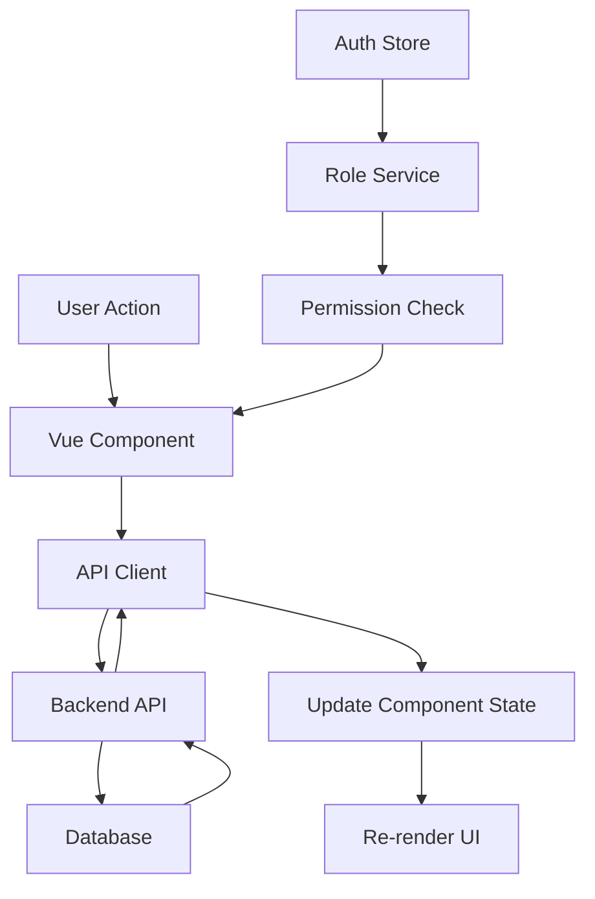

# Design Document

## Overview

การออกแบบหน้า UI สำหรับจัดการแผนกและพนักงานจะใช้สถาปัตยกรรมแบบ Vue 3 Composition API ร่วมกับ Vuetify 3 ซึ่งเป็น pattern ที่ใช้อยู่ในระบบปัจจุบัน โดยจะสร้าง 2 หน้าหลัก คือ DepartmentListView และ EmployeeListView พร้อมด้วย drawer components สำหรับ Create, Update และ Detail ของแต่ละ entity

ระบบจะเชื่อมต่อกับ backend API ที่มีอยู่แล้วผ่าน NSwag generated client และใช้ RoleService สำหรับการตรวจสอบสิทธิ์การเข้าถึง

## Architecture

### Component Structure

```
src/client_web/src/
├── views/
│   └── MasterData/
│       ├── Departments/
│       │   ├── DepartmentListView.vue          # หน้าแสดงรายการแผนก
│       │   ├── CreateDepartment.vue            # Drawer สำหรับสร้างแผนก
│       │   ├── UpdateDepartment.vue            # Drawer สำหรับแก้ไขแผนก
│       │   └── DepartmentDetail.vue            # Drawer สำหรับดูรายละเอียดแผนก
│       └── Employees/
│           ├── EmployeeListView.vue            # หน้าแสดงรายการพนักงาน
│           ├── CreateEmployee.vue              # Drawer สำหรับสร้างพนักงาน
│           ├── UpdateEmployee.vue              # Drawer สำหรับแก้ไขพนักงาน
│           └── EmployeeDetail.vue              # Drawer สำหรับดูรายละเอียดพนักงาน
└── plugins/
    └── router/
        └── MasterData.ts                       # เพิ่ม routes สำหรับ Departments และ Employees
```

### Technology Stack

- **Frontend Framework**: Vue 3 (Composition API with Options API style)
- **UI Framework**: Vuetify 3
- **State Management**: Pinia stores (useAuthStore, useSweetAlertStore)
- **API Client**: NSwag generated TypeScript client
- **Routing**: Vue Router with role-based guards
- **Form Validation**: Vuetify built-in validation + custom rules

### Data Flow



## Components and Interfaces

### 1. DepartmentListView Component

**Purpose**: แสดงรายการแผนกทั้งหมดพร้อมฟีเจอร์ค้นหา, pagination และการจัดการ

**Key Features**:
- Data table with server-side pagination
- Search functionality
- Create/Edit/Delete/View actions (based on permissions)
- Row highlighting for newly created/updated items
- Responsive drawer for forms

**Data Structure**:
```typescript
interface DepartmentListData {
  header: Array<{ title: string; value: string; align?: string }>
  search: string
  data: DepartmentDto[]
  request: GetDepartmentWithPaginationQuery
  pageNumber: number
  pageSize: number
  totalItem: number
  id: string
  DialogCreate: boolean
  DialogEdit: boolean
  DialogDetail: boolean
  isLoading: boolean
}
```

**Methods**:
- `initialize()`: โหลดข้อมูลแผนกจาก API
- `handlePageChange(page)`: จัดการการเปลี่ยนหน้า
- `handlePageSizeChange(size)`: จัดการการเปลี่ยนจำนวนแถวต่อหน้า
- `OpenDialogCreate()`: เปิด drawer สำหรับสร้างแผนก
- `CloseDialogCreate(value, reload, searchData)`: ปิด drawer และ refresh ข้อมูล
- `OpenDialogEdit(id)`: เปิด drawer สำหรับแก้ไขแผนก
- `CloseDialogEdit(value, reload)`: ปิด drawer และ refresh ข้อมูล
- `OpenDialogDetail(id)`: เปิด drawer สำหรับดูรายละเอียดแผนก
- `CloseDialogDetail(value, reload)`: ปิด drawer
- `OpenDelete(id)`: แสดง confirmation dialog และลบแผนก
- `canAccessMasterData()`: ตรวจสอบสิทธิ์การเข้าถึง
- `canModifyMasterData()`: ตรวจสอบสิทธิ์การแก้ไข

**API Calls**:
- `client.getDepartmentWithPagination(request)`: ดึงข้อมูลแผนกแบบ pagination
- `client.deleteDepartment(id)`: ลบแผนก

### 2. CreateDepartment Component

**Purpose**: Drawer form สำหรับสร้างแผนกใหม่

**Form Fields**:
- `name` (required): ชื่อแผนก - VTextField
- `isActive` (required): สถานะการใช้งาน - VCheckbox (default: true)

**Validation Rules**:
- `name`: required, min length 2, max length 100
- `isActive`: boolean

**Methods**:
- `save()`: บันทึกข้อมูลแผนกใหม่
- `cancel()`: ยกเลิกและปิด drawer
- `resetForm()`: รีเซ็ตฟอร์ม

**API Calls**:
- `client.createDepartment(command)`: สร้างแผนกใหม่

### 3. UpdateDepartment Component

**Purpose**: Drawer form สำหรับแก้ไขข้อมูลแผนก

**Props**:
- `id`: string (Department ID)
- `CloseDialogEdit`: Function

**Form Fields**: เหมือน CreateDepartment

**Methods**:
- `loadDepartment()`: โหลดข้อมูลแผนกที่ต้องการแก้ไข
- `save()`: บันทึกการแก้ไข
- `cancel()`: ยกเลิกและปิด drawer

**API Calls**:
- `client.getDepartmentQueryByID(id)`: ดึงข้อมูลแผนกตาม ID
- `client.updateDepartment(command)`: อัพเดทข้อมูลแผนก

### 4. DepartmentDetail Component

**Purpose**: Drawer สำหรับแสดงรายละเอียดแผนก (read-only)

**Props**:
- `id`: string (Department ID)
- `CloseDialogDetail`: Function

**Display Fields**:
- ชื่อแผนก
- สถานะการใช้งาน
- วันที่สร้าง
- ผู้สร้าง
- วันที่แก้ไขล่าสุด
- ผู้แก้ไขล่าสุด

**Methods**:
- `loadDepartment()`: โหลดข้อมูลแผนก
- `close()`: ปิด drawer

**API Calls**:
- `client.getDepartmentQueryByID(id)`: ดึงข้อมูลแผนกตาม ID

### 5. EmployeeListView Component

**Purpose**: แสดงรายการพนักงานทั้งหมดพร้อมฟีเจอร์ค้นหา, กรอง และการจัดการ

**Key Features**:
- Data table with server-side pagination
- Search functionality (name, email, position)
- Filter by department
- Filter by active status
- Create/Edit/Delete/View actions (based on permissions)
- Display employee profile images
- Row highlighting for newly created/updated items

**Data Structure**:
```typescript
interface EmployeeListData {
  header: Array<{ title: string; value: string; align?: string }>
  search: string
  data: EmployeeDto[]
  request: GetEmployeeWithPaginationQuery
  pageNumber: number
  pageSize: number
  totalItem: number
  id: string
  departments: DepartmentDto[]
  selectedDepartment: string | null
  selectedStatus: boolean | null
  DialogCreate: boolean
  DialogEdit: boolean
  DialogDetail: boolean
  isLoading: boolean
}
```

**Methods**:
- `initialize()`: โหลดข้อมูลพนักงานและแผนก
- `loadDepartments()`: โหลดรายการแผนกสำหรับ filter
- `handlePageChange(page)`: จัดการการเปลี่ยนหน้า
- `handlePageSizeChange(size)`: จัดการการเปลี่ยนจำนวนแถวต่อหน้า
- `applyFilters()`: ใช้ filter และ refresh ข้อมูล
- `clearFilters()`: ล้าง filter ทั้งหมด
- `OpenDialogCreate()`: เปิด drawer สำหรับสร้างพนักงาน
- `CloseDialogCreate(value, reload, searchData)`: ปิด drawer และ refresh ข้อมูล
- `OpenDialogEdit(id)`: เปิด drawer สำหรับแก้ไขพนักงาน
- `CloseDialogEdit(value, reload)`: ปิด drawer และ refresh ข้อมูล
- `OpenDialogDetail(id)`: เปิด drawer สำหรับดูรายละเอียดพนักงาน
- `CloseDialogDetail(value, reload)`: ปิด drawer
- `OpenDelete(id)`: แสดง confirmation dialog และลบพนักงาน
- `getDepartmentName(departmentId)`: แปลง department ID เป็นชื่อแผนก
- `canAccessDepartmentData()`: ตรวจสอบสิทธิ์การเข้าถึง
- `canModifyMasterData()`: ตรวจสอบสิทธิ์การแก้ไข

**API Calls**:
- `client.getEmployeeWithPagination(request)`: ดึงข้อมูลพนักงานแบบ pagination
- `client.getDepartmentQuery()`: ดึงรายการแผนกทั้งหมด
- `client.deleteEmployee(id)`: ลบพนักงาน

### 6. CreateEmployee Component

**Purpose**: Drawer form สำหรับสร้างพนักงานใหม่

**Form Fields**:
- `userId` (required): User ID - VTextField
- `titleName`: คำนำหน้าชื่อ - VSelect (นาย, นาง, นางสาว, etc.)
- `firstName` (required): ชื่อ - VTextField
- `lastName` (required): นามสกุล - VTextField
- `email` (required): อีเมล - VTextField with email validation
- `position`: ตำแหน่ง - VTextField
- `phone`: เบอร์โทร - VTextField with phone validation
- `imageProfile`: รูปโปรไฟล์ - VFileInput (accept: image/*)
- `isActive`: สถานะการใช้งาน - VCheckbox (default: true)
- `departmentId`: แผนก - VSelect (from departments list)
- `subscription`: การแจ้งเตือน - VCheckbox
- `roles`: บทบาท - VTextField
- `group`: กลุ่ม - VTextField

**Validation Rules**:
- `userId`: required
- `firstName`: required, min length 2
- `lastName`: required, min length 2
- `email`: required, valid email format
- `phone`: optional, valid phone format (10 digits)
- `imageProfile`: optional, file type (jpg, png, gif), max size 5MB

**Methods**:
- `loadDepartments()`: โหลดรายการแผนก
- `handleImageUpload(file)`: จัดการการอัพโหลดรูปภาพ
- `previewImage(file)`: แสดงตัวอย่างรูปภาพ
- `save()`: บันทึกข้อมูลพนักงานใหม่
- `cancel()`: ยกเลิกและปิด drawer
- `resetForm()`: รีเซ็ตฟอร์ม

**API Calls**:
- `client.getDepartmentQuery()`: ดึงรายการแผนกทั้งหมด
- `client.createEmployee(command)`: สร้างพนักงานใหม่

### 7. UpdateEmployee Component

**Purpose**: Drawer form สำหรับแก้ไขข้อมูลพนักงาน

**Props**:
- `id`: string (Employee ID)
- `CloseDialogEdit`: Function

**Form Fields**: เหมือน CreateEmployee

**Methods**:
- `loadEmployee()`: โหลดข้อมูลพนักงานที่ต้องการแก้ไข
- `loadDepartments()`: โหลดรายการแผนก
- `handleImageUpload(file)`: จัดการการอัพโหลดรูปภาพ
- `previewImage(file)`: แสดงตัวอย่างรูปภาพ
- `save()`: บันทึกการแก้ไข
- `cancel()`: ยกเลิกและปิด drawer

**API Calls**:
- `client.getEmployeeQueryByID(id)`: ดึงข้อมูลพนักงานตาม ID
- `client.getDepartmentQuery()`: ดึงรายการแผนกทั้งหมด
- `client.updateEmployee(command)`: อัพเดทข้อมูลพนักงาน

### 8. EmployeeDetail Component

**Purpose**: Drawer สำหรับแสดงรายละเอียดพนักงาน (read-only)

**Props**:
- `id`: string (Employee ID)
- `CloseDialogDetail`: Function

**Display Fields**:
- รูปโปรไฟล์
- คำนำหน้าชื่อ
- ชื่อ-นามสกุล
- อีเมล
- ตำแหน่ง
- เบอร์โทร
- แผนก
- สถานะการใช้งาน
- การแจ้งเตือน
- บทบาท
- กลุ่ม
- วันที่สร้าง
- ผู้สร้าง
- วันที่แก้ไขล่าสุด
- ผู้แก้ไขล่าสุด

**Methods**:
- `loadEmployee()`: โหลดข้อมูลพนักงาน
- `getDepartmentName(departmentId)`: แปลง department ID เป็นชื่อแผนก
- `close()`: ปิด drawer

**API Calls**:
- `client.getEmployeeQueryByID(id)`: ดึงข้อมูลพนักงานตาม ID
- `client.getDepartmentQuery()`: ดึงรายการแผนกทั้งหมด

## Data Models

### DepartmentDto (from backend)

```typescript
interface DepartmentDto {
  id: string
  name: string
  isActive: boolean
  created?: Date
  createdBy?: string
  lastModified?: Date
  lastModifiedBy?: string
}
```

### EmployeeDto (from backend)

```typescript
interface EmployeeDto {
  id: string
  userId: string
  titleName?: string
  firstName?: string
  lastName?: string
  email: string
  position?: string
  phone?: string
  imageProfile?: string
  isActive?: boolean
  departmentId?: string
  departments?: DepartmentDto
  subscription?: boolean
  roles?: string
  group?: string
  created?: Date
  createdBy?: string
  lastModified?: Date
  lastModifiedBy?: string
}
```

### API Request Models

```typescript
// Department Commands
interface CreateDepartmentCommand {
  name: string
  isActive: boolean
}

interface UpdateDepartmentCommand {
  id: string
  name: string
  isActive: boolean
}

// Employee Commands
interface CreateEmployeeCommand {
  userId: string
  titleName?: string
  firstName?: string
  lastName?: string
  email: string
  position?: string
  phone?: string
  imageProfile?: string
  isActive?: boolean
  departmentId?: string
  subscription?: boolean
  roles?: string
  group?: string
}

interface UpdateEmployeeCommand {
  id: string
  userId: string
  titleName?: string
  firstName?: string
  lastName?: string
  email: string
  position?: string
  phone?: string
  imageProfile?: string
  isActive?: boolean
  departmentId?: string
  subscription?: boolean
  roles?: string
  group?: string
}

// Query Models
interface GetDepartmentWithPaginationQuery {
  search?: string
  pageNumber: number
  pageSize: number
}

interface GetEmployeeWithPaginationQuery {
  search?: string
  departmentId?: string
  isActive?: boolean
  pageNumber: number
  pageSize: number
}
```

## Error Handling

### API Error Handling Strategy

1. **Network Errors**: แสดง error message ผ่าน SweetAlert
2. **Validation Errors**: แสดง field-level validation errors
3. **Authorization Errors**: redirect ไปหน้า not-authorized
4. **Server Errors**: แสดง generic error message

### Error Handling Implementation

```typescript
try {
  const response = await client.createDepartment(command)
  if (response) {
    this.sweetAlert.success('บันทึกข้อมูลสำเร็จ')
    this.CloseDialogCreate(false, true, JSON.stringify(command))
  }
} catch (error: any) {
  console.error('Error creating department:', error)
  
  if (error.status === 401) {
    this.sweetAlert.error('คุณไม่มีสิทธิ์ในการทำรายการนี้')
    this.$router.push('/not-authorized')
  } else if (error.status === 400) {
    this.sweetAlert.error('ข้อมูลไม่ถูกต้อง กรุณาตรวจสอบอีกครั้ง')
  } else {
    this.sweetAlert.error('เกิดข้อผิดพลาดในการบันทึกข้อมูล')
  }
}
```

## Testing Strategy

### Unit Testing

ไม่จำเป็นต้องเขียน unit tests สำหรับ UI components เนื่องจากเป็น MVP และต้องการความเร็วในการพัฒนา

### Manual Testing Checklist

**Department Management**:
- [ ] สามารถดูรายการแผนกได้
- [ ] สามารถค้นหาแผนกได้
- [ ] สามารถสร้างแผนกใหม่ได้ (Admin/Manager)
- [ ] สามารถแก้ไขแผนกได้ (Admin/Manager)
- [ ] สามารถลบแผนกได้ (Admin/Manager)
- [ ] สามารถดูรายละเอียดแผนกได้
- [ ] Pagination ทำงานถูกต้อง
- [ ] Validation ทำงานถูกต้อง
- [ ] Permission checking ทำงานถูกต้อง

**Employee Management**:
- [ ] สามารถดูรายการพนักงานได้
- [ ] สามารถค้นหาพนักงานได้
- [ ] สามารถกรองตามแผนกได้
- [ ] สามารถกรองตามสถานะได้
- [ ] สามารถสร้างพนักงานใหม่ได้ (Admin/Manager)
- [ ] สามารถแก้ไขพนักงานได้ (Admin/Manager)
- [ ] สามารถลบพนักงานได้ (Admin/Manager)
- [ ] สามารถดูรายละเอียดพนักงานได้
- [ ] สามารถอัพโหลดรูปโปรไฟล์ได้
- [ ] แสดงรูปโปรไฟล์ในตารางได้
- [ ] Pagination ทำงานถูกต้อง
- [ ] Validation ทำงานถูกต้อง
- [ ] Permission checking ทำงานถูกต้อง

**Responsive Design**:
- [ ] แสดงผลถูกต้องบน Desktop
- [ ] แสดงผลถูกต้องบน Tablet
- [ ] แสดงผลถูกต้องบน Mobile
- [ ] Drawer เปิด/ปิดถูกต้องบนทุกอุปกรณ์

**Navigation**:
- [ ] สามารถนำทางระหว่างหน้าได้
- [ ] Browser back button ทำงานถูกต้อง
- [ ] Unauthorized users ถูก redirect

## UI/UX Design Patterns

### Layout Pattern

ใช้ pattern เดียวกับ OrganizationListView:
- Header section: ชื่อหน้า + ปุ่มเพิ่มข้อมูล (ถ้ามีสิทธิ์)
- Search section: ช่องค้นหา + filters (สำหรับ Employee)
- Table section: Data table with pagination
- Drawer section: Right-side drawer สำหรับ forms

### Color Scheme

- Primary: #2b3086 (ใช้สำหรับ headers และ primary buttons)
- Info: rgba(var(--v-theme-info)) (ใช้สำหรับ view buttons)
- Warning: rgba(var(--v-theme-warning)) (ใช้สำหรับ edit buttons)
- Error: rgba(var(--v-theme-error)) (ใช้สำหรับ delete buttons)
- Success: rgba(var(--v-theme-success)) (ใช้สำหรับ success messages)

### Typography

- Page Title: 25px, bold, color: #2b3086
- Table Headers: Vuetify default
- Form Labels: Vuetify default
- Body Text: Vuetify default

### Spacing

- Card padding: 16px
- Form field spacing: 16px (mb-4)
- Button spacing: 8px (mr-2)
- Section spacing: 16px (mb-2)

### Icons

ใช้ Remix Icons (ri-*):
- Department: ri-building-line
- Employee: ri-user-line
- Add: ri-add-circle-line
- Edit: ri-edit-2-line
- Delete: ri-delete-bin-6-line
- View: ri-article-line
- Search: ri-search-line

## Routing Configuration

### Route Definitions

```typescript
// เพิ่มใน src/client_web/src/plugins/router/MasterData.ts

{
  path: 'MasterData/DepartmentListView',
  name: 'DepartmentListView',
  component: () => import('@/views/MasterData/Departments/DepartmentListView.vue'),
  meta: {
    requiresAuth: true,
    roles: ['Admin', 'Manager']
  }
},
{
  path: 'MasterData/EmployeeListView',
  name: 'EmployeeListView',
  component: () => import('@/views/MasterData/Employees/EmployeeListView.vue'),
  meta: {
    requiresAuth: true,
    roles: ['Admin', 'Manager']
  }
}
```

### Permission Matrix

| Role | View Departments | Modify Departments | View Employees | Modify Employees |
|------|-----------------|-------------------|----------------|------------------|
| Admin | ✓ | ✓ | ✓ | ✓ |
| Manager | ✓ | ✓ | ✓ | ✓ |
| Viewer | ✗ | ✗ | ✗ | ✗ |

## Performance Considerations

### Optimization Strategies

1. **Lazy Loading**: ใช้ dynamic imports สำหรับ drawer components
2. **Server-side Pagination**: ดึงข้อมูลเฉพาะหน้าที่แสดง
3. **Debounced Search**: ใช้ debounce สำหรับ search input (300ms)
4. **Image Optimization**: จำกัดขนาดไฟล์รูปภาพไม่เกิน 5MB
5. **Conditional Rendering**: ใช้ v-if สำหรับ drawers เพื่อไม่ render จนกว่าจะเปิด

### Loading States

- แสดง loading indicator ขณะดึงข้อมูล
- แสดง skeleton loader สำหรับ table (optional)
- Disable buttons ขณะ submit form

## Security Considerations

### Client-side Security

1. **Role-based Access Control**: ตรวจสอบสิทธิ์ผ่าน RoleService
2. **Route Guards**: ใช้ roleGuard ใน router
3. **Token Validation**: ตรวจสอบ JWT token expiration
4. **Input Sanitization**: ใช้ Vuetify validation rules
5. **XSS Prevention**: Vue.js auto-escapes content

### API Security

- ใช้ JWT token สำหรับ authentication
- Backend จะตรวจสอบ permissions อีกครั้ง
- HTTPS สำหรับ production

## Accessibility

### WCAG 2.1 Compliance

1. **Keyboard Navigation**: รองรับการใช้งานด้วย keyboard
2. **Screen Reader Support**: ใช้ semantic HTML และ ARIA labels
3. **Color Contrast**: ใช้สีที่มี contrast ratio เพียงพอ
4. **Focus Indicators**: แสดง focus state ชัดเจน
5. **Form Labels**: ทุก input มี label ที่ชัดเจน

### Implementation

- ใช้ Vuetify components ที่รองรับ accessibility
- เพิ่ม aria-label สำหรับ icon buttons
- ใช้ v-tooltip สำหรับ action buttons
- รองรับ keyboard shortcuts (ESC สำหรับปิด drawer)

## Internationalization (i18n)

ปัจจุบันระบบใช้ภาษาไทยเป็นหลัก ไม่จำเป็นต้องใช้ i18n library ในขั้นนี้ แต่ควรเตรียมพร้อมสำหรับอนาคต:

- ใช้ constants สำหรับ text strings
- แยก labels และ messages ออกจาก components
- พิจารณาใช้ vue-i18n ในอนาคต
