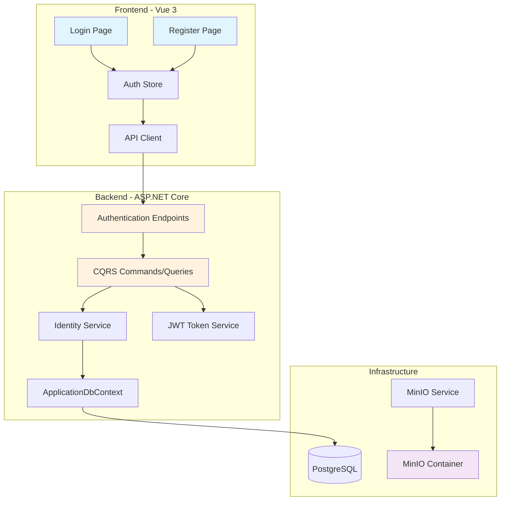
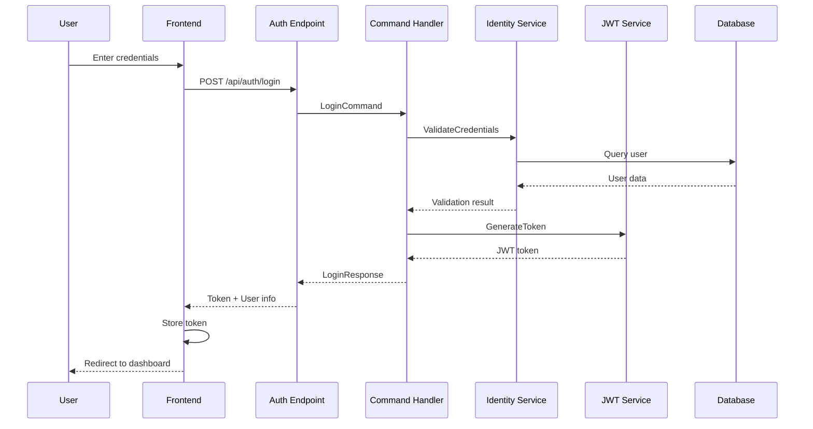

# Design Document

## Overview

การออกแบบนี้มุ่งเน้นการเปลี่ยนระบบ authentication จาก OpenID Connect (ntiportal) เป็นระบบ JWT-based local authentication ที่สมบูรณ์ โดยคงโครงสร้าง Clean Architecture เดิมไว้ และเพิ่มฟีเจอร์ login/register ใหม่ พร้อมทั้งย้าย MinIO มาเป็น Docker container

ระบบจะใช้ ASP.NET Core Identity ที่มีอยู่แล้วในโปรเจกต์ แต่จะเปลี่ยนจากการ authenticate ผ่าน external provider มาเป็นการจัดการ credentials เองทั้งหมด

## Architecture

### High-Level Architecture



### Authentication Flow



## Components and Interfaces

### Backend Components

#### 1. Domain Layer (src/Domain)

**ApplicationUser Entity** (แก้ไขเดิม)
```csharp
public class ApplicationUser : IdentityUser
{
    public bool IsRevoked { get; set; }
    public DateTime RevokeStart { get; set; }
    public DateTime RevokeEnd { get; set; }
    public bool RequirePasswordChange { get; set; } // ใหม่
    public DateTime? LastPasswordChangeDate { get; set; } // ใหม่
}
```

#### 2. Application Layer (src/Application)

**Commands:**

- `LoginCommand` - จัดการการ login
  - Input: Email/Username, Password
  - Output: JWT Token, User Info, Roles
  
- `RegisterCommand` - จัดการการสมัครสมาชิก
  - Input: Email, Username, Password, ConfirmPassword, FirstName, LastName
  - Output: Success/Failure result
  
- `ChangePasswordCommand` - เปลี่ยนรหัสผ่าน (มีอยู่แล้ว - ปรับปรุง)
  - Input: UserId, OldPassword, NewPassword
  - Output: Success/Failure result

- `RefreshTokenCommand` - รีเฟรช JWT token
  - Input: Expired token
  - Output: New JWT token

**Queries:**

- `GetCurrentUserQuery` - ดึงข้อมูลผู้ใช้ปัจจุบัน
  - Output: User profile data

**DTOs:**

```csharp
public class LoginDto
{
    public string EmailOrUsername { get; set; }
    public string Password { get; set; }
}

public class LoginResponseDto
{
    public string Token { get; set; }
    public string UserId { get; set; }
    public string Email { get; set; }
    public string Username { get; set; }
    public string FirstName { get; set; }
    public string LastName { get; set; }
    public List<string> Roles { get; set; }
    public DateTime TokenExpiration { get; set; }
}

public class RegisterDto
{
    public string Email { get; set; }
    public string Username { get; set; }
    public string Password { get; set; }
    public string ConfirmPassword { get; set; }
    public string FirstName { get; set; }
    public string LastName { get; set; }
}
```

**Interfaces:**

```csharp
public interface IJwtTokenService
{
    string GenerateToken(ApplicationUser user, IList<string> roles);
    ClaimsPrincipal ValidateToken(string token);
    DateTime GetTokenExpiration(string token);
}

public interface IIdentityService
{
    // เดิม
    Task<string?> GetUserNameAsync(string userId);
    Task<(Result Result, string UserId)> CreateUserAsync(string userName, string password);
    Task<bool> IsInRoleAsync(string userId, string role);
    Task<bool> AuthorizeAsync(string userId, string policyName);
    Task<Result> DeleteUserAsync(string userId);
    
    // ใหม่
    Task<(Result Result, LoginResponseDto Data)> AuthenticateAsync(string emailOrUsername, string password);
    Task<(Result Result, string UserId)> RegisterUserAsync(RegisterDto registerDto);
    Task<ApplicationUser?> FindByEmailOrUsernameAsync(string emailOrUsername);
}
```

#### 3. Infrastructure Layer (src/Infrastructure)

**JwtTokenService** (ใหม่)
- สร้าง JWT tokens
- Validate tokens
- จัดการ claims (userId, email, username, roles)
- กำหนด expiration time

**IdentityService** (แก้ไขเดิม)
- เพิ่ม methods สำหรับ authentication
- จัดการ password hashing
- ตรวจสอบ credentials

**Configuration Updates:**
- ลบ OpenID Connect configuration
- เพิ่ม JWT configuration (secret key, issuer, audience, expiration)
- อัพเดต MinIO configuration ให้ชี้ไปยัง Docker container

#### 4. Web Layer (src/Web)

**AuthenticationEndpoint** (ใหม่)
```csharp
public class AuthenticationEndpoint : EndpointGroupBase
{
    public override void Map(WebApplication app)
    {
        app.MapGroup(this)
            .MapPost(Login, "login")
            .MapPost(Register, "register")
            .MapPost(RefreshToken, "refresh-token")
            .MapGet(GetCurrentUser, "me")
            .RequireAuthorization();
    }
    
    public async Task<LoginResponseDto> Login(ISender sender, LoginDto dto);
    public async Task<Result> Register(ISender sender, RegisterDto dto);
    public async Task<LoginResponseDto> RefreshToken(ISender sender);
    public async Task<AuthenticationUserDto> GetCurrentUser(ISender sender);
}
```

### Frontend Components

#### 1. Pages (src/client_web/src/pages)

**login.vue** (ใหม่)
- ฟอร์ม login (email/username, password)
- Remember me checkbox
- ลิงก์ไปหน้า register
- Error handling และ validation
- Loading state

**register.vue** (ใหม่)
- ฟอร์มลงทะเบียน (email, username, password, confirm password, ชื่อ-นามสกุล)
- Password strength indicator
- Terms and conditions checkbox
- ลิงก์กลับไปหน้า login
- Validation และ error handling

#### 2. Store (src/client_web/src/stores)

**auth.ts** (แก้ไขใหญ่)

ลบ/แก้ไข:
- ลบ OpenID Connect logic ทั้งหมด
- ลบการเรียก ntiportal APIs
- ลบ `objEmployeeByUsernameAD` method

เพิ่ม:
```typescript
interface AuthState {
  token: string
  isLogged: boolean
  userId: string
  username: string
  email: string
  firstName: string
  lastName: string
  roles: string[]
  // ลบ fields ที่เกี่ยวกับ OpenID
}

actions: {
  async login(email: string, password: string): Promise<boolean>
  async register(registerData: RegisterDto): Promise<boolean>
  async logout(): Promise<void>
  async refreshToken(): Promise<void>
  async getCurrentUser(): Promise<void>
  // ลบ restoreData, decodeJWT methods เดิม
}
```

#### 3. Router (src/client_web/src/plugins/router)

**OpenId.ts** - ลบไฟล์นี้ทั้งหมด

**index.ts** (แก้ไข)
- อัพเดต navigation guard
- ตรวจสอบ token expiration
- Redirect ไป /login ถ้าไม่มี token หรือ token หมดอายุ

**routes.ts** (แก้ไข)
- ลบ OpenID routes
- เพิ่ม /login และ /register routes (มีอยู่แล้ว)

#### 4. API Client (src/client_web/src/client.ts)

อัพเดต API client configuration:
- เพิ่ม authentication endpoints
- อัพเดต token handling
- ลบ OpenID related methods

## Data Models

### Database Schema Changes

**AspNetUsers Table** (มีอยู่แล้วจาก Identity)
- เพิ่ม columns:
  - `RequirePasswordChange` (bit)
  - `LastPasswordChangeDate` (datetime2)

**Migration Script:**
```sql
ALTER TABLE AspNetUsers 
ADD RequirePasswordChange bit NOT NULL DEFAULT 0,
    LastPasswordChangeDate datetime2 NULL;

-- สร้าง default password สำหรับ users เดิม
UPDATE AspNetUsers 
SET RequirePasswordChange = 1 
WHERE PasswordHash IS NULL OR PasswordHash = '';
```

### JWT Token Structure

```json
{
  "sub": "user-id",
  "email": "user@example.com",
  "username": "username",
  "given_name": "FirstName",
  "family_name": "LastName",
  "role": ["CRM", "Employee"],
  "nbf": 1234567890,
  "exp": 1234654290,
  "iat": 1234567890,
  "iss": "ProjectManagement",
  "aud": "ProjectManagement.Client"
}
```

## Configuration Changes

### Backend Configuration

**appsettings.json** (แก้ไข)

ลบ:
```json
"OpenIDConnectSettings": {
  "Authority": "https://ntiportal.nti.co.th/",
  "url": "https://ntiportal.nti.co.th/connect/token",
  "redirect_uri": "https://ntiportal.nti.co.th/signin-oidc",
  "ClientId": "oidc-pkce-confidential",
  "ClientSecret": "oidc-pkce-confidential_secret"
}
```

เพิ่ม:
```json
"JwtSettings": {
  "SecretKey": "your-secret-key-min-32-characters-long",
  "Issuer": "ProjectManagement",
  "Audience": "ProjectManagement.Client",
  "ExpirationHours": 24
},
"MinIO": {
  "Endpoint": "minio:9000",
  "AccessKey": "minioadmin",
  "SecretKey": "minioadmin",
  "UseSSL": false,
  "BucketName": "projectmanagement"
}
```

**DependencyInjection.cs** (แก้ไข)

ลบ OpenID Connect configuration, เพิ่ม:
```csharp
builder.Services.AddAuthentication(JwtBearerDefaults.AuthenticationScheme)
    .AddJwtBearer(options =>
    {
        var jwtSettings = configuration.GetSection("JwtSettings");
        options.TokenValidationParameters = new TokenValidationParameters
        {
            ValidateIssuer = true,
            ValidateAudience = true,
            ValidateLifetime = true,
            ValidateIssuerSigningKey = true,
            ValidIssuer = jwtSettings["Issuer"],
            ValidAudience = jwtSettings["Audience"],
            IssuerSigningKey = new SymmetricSecurityKey(
                Encoding.UTF8.GetBytes(jwtSettings["SecretKey"]))
        };
    });

builder.Services.AddScoped<IJwtTokenService, JwtTokenService>();
```

### Frontend Configuration

**constants.ts** (แก้ไข)

ลบ:
```typescript
export const PortalOpenId = 'https://ntiportal.nti.co.th/connect'
export const ClientId = '...'
export const ClientSecret = '...'
export const code_verifier = '...'
export const code_challenge = '...'
```

เพิ่ม:
```typescript
export const AUTH_ENDPOINTS = {
  LOGIN: '/api/auth/login',
  REGISTER: '/api/auth/register',
  REFRESH: '/api/auth/refresh-token',
  ME: '/api/auth/me'
}
```

### Docker Configuration

**docker-compose.yml** (แก้ไข)

ลบ environment variables:
```yaml
- Authority=https://ntiportal.nti.co.th/
- MinIOUrlExternal=192.168.98.142:9000
- MinIOUrlInternal=192.168.98.142:9000
- MinIOAccessKey=im8OFJnjH61sk6k2qNdw
- MinIOSecretKey=U3BDpc3Rw4cJL0OS493gpn2Fwzl8TffROTYOUnmz
```

เพิ่ม MinIO service:
```yaml
services:
  minio:
    image: minio/minio:latest
    container_name: minio
    ports:
      - "9000:9000"
      - "9001:9001"
    environment:
      MINIO_ROOT_USER: minioadmin
      MINIO_ROOT_PASSWORD: minioadmin
    command: server /data --console-address ":9001"
    volumes:
      - minio_data:/data
    healthcheck:
      test: ["CMD", "curl", "-f", "http://localhost:9000/minio/health/live"]
      interval: 30s
      timeout: 20s
      retries: 3

volumes:
  minio_data:
```

อัพเดต application service:
```yaml
projectmanagement-application-core:
  environment:
    - MinIOEndpoint=minio:9000
    - MinIOAccessKey=minioadmin
    - MinIOSecretKey=minioadmin
    - JwtSecretKey=your-secret-key-min-32-characters-long
    - JwtIssuer=ProjectManagement
    - JwtAudience=ProjectManagement.Client
  depends_on:
    - postgres
    - minio
```

## Removal of Line Bot Integration

### Files to Delete/Modify

**Commands to Remove:**
- `src/Application/CheckInCheckOuts/Commands/CreateCheckInCheckOutForLineCommand.cs` - ลบ method ที่เรียก ntiportal
- `src/Application/CheckInCheckOuts/Queries/CheckLineUserIdCheckInCheckOutToDayQuery.cs` - ลบ method ที่เรียก ntiportal

**Modifications:**
- ถ้ามี Line-related endpoints ใน `CheckInCheckOutEndpoint.cs` ให้ลบออก
- ถ้ามี Line user ID fields ในฐานข้อมูล ให้เก็บไว้ (backward compatibility) แต่ไม่ต้องใช้งาน

## Error Handling

### Backend Error Responses

```csharp
public class AuthenticationException : Exception
{
    public AuthenticationException(string message) : base(message) { }
}

// Error codes
public static class AuthErrorCodes
{
    public const string InvalidCredentials = "AUTH001";
    public const string UserNotFound = "AUTH002";
    public const string EmailAlreadyExists = "AUTH003";
    public const string WeakPassword = "AUTH004";
    public const string TokenExpired = "AUTH005";
    public const string InvalidToken = "AUTH006";
}
```

### Frontend Error Handling

```typescript
// Error messages in Thai
const AUTH_ERRORS = {
  AUTH001: 'อีเมลหรือรหัสผ่านไม่ถูกต้อง',
  AUTH002: 'ไม่พบผู้ใช้งานในระบบ',
  AUTH003: 'อีเมลนี้ถูกใช้งานแล้ว',
  AUTH004: 'รหัสผ่านไม่ปลอดภัยเพียงพอ',
  AUTH005: 'เซสชันหมดอายุ กรุณาเข้าสู่ระบบใหม่',
  AUTH006: 'ข้อมูลการเข้าสู่ระบบไม่ถูกต้อง'
}
```

## Security Considerations

### Password Policy

- ความยาวขั้นต่ำ: 6 ตัวอักษร
- ต้องมีตัวพิมพ์ใหญ่อย่างน้อย 1 ตัว (optional - ปรับได้)
- ต้องมีตัวเลขอย่างน้อย 1 ตัว (optional - ปรับได้)
- Hash ด้วย ASP.NET Core Identity (PBKDF2)

### JWT Token Security

- Secret key ต้องมีความยาวอย่างน้อย 32 characters
- Token expiration: 24 ชั่วโมง (ปรับได้)
- Refresh token mechanism (optional - สำหรับ phase 2)
- HTTPS only ใน production

### API Security

- Rate limiting สำหรับ login endpoint
- Account lockout หลังจาก login ผิดหลายครั้ง (ใช้ Identity lockout)
- CORS configuration ที่เหมาะสม

## Testing Strategy

### Unit Tests

**Backend:**
- `LoginCommandHandlerTests` - ทดสอบ login logic
- `RegisterCommandHandlerTests` - ทดสอบ registration logic
- `JwtTokenServiceTests` - ทดสอบการสร้างและ validate tokens
- `IdentityServiceTests` - ทดสอบ authentication methods

**Frontend:**
- `auth.store.spec.ts` - ทดสอบ auth store actions
- `login.spec.ts` - ทดสอบ login component
- `register.spec.ts` - ทดสอบ register component

### Integration Tests

- `AuthenticationEndpointTests` - ทดสอบ API endpoints
- `AuthenticationFlowTests` - ทดสอบ flow ทั้งหมดตั้งแต่ login จนถึง authenticated request

### Manual Testing Checklist

- [ ] Login ด้วย email
- [ ] Login ด้วย username
- [ ] Login ด้วย credentials ผิด
- [ ] Register user ใหม่
- [ ] Register ด้วย email ซ้ำ
- [ ] Password validation
- [ ] Token expiration handling
- [ ] Logout และ clear session
- [ ] Protected routes redirect
- [ ] MinIO file upload/download
- [ ] Migration script สำหรับ users เดิม

## Migration Plan

### Phase 1: Backend Setup
1. สร้าง JWT token service
2. สร้าง authentication commands/queries
3. อัพเดต Identity service
4. สร้าง authentication endpoints
5. อัพเดต configuration
6. เพิ่ม MinIO ใน docker-compose

### Phase 2: Frontend Implementation
1. สร้างหน้า login
2. สร้างหน้า register
3. อัพเดต auth store
4. อัพเดต router guards
5. ลบ OpenID components

### Phase 3: Cleanup
1. ลบ OpenID Connect configuration
2. ลบ ntiportal references
3. ลบ Line Bot integration
4. อัพเดต documentation

### Phase 4: Data Migration
1. สร้าง migration script สำหรับ users เดิม
2. ทดสอบ migration
3. รัน migration ใน production

## Performance Considerations

- JWT token validation เป็น stateless - ไม่ต้อง query database ทุกครั้ง
- MinIO ใน Docker network - latency ต่ำกว่า external server
- Connection pooling สำหรับ PostgreSQL
- Cache user roles ใน JWT claims

## Rollback Plan

ถ้าเกิดปัญหา:
1. Revert docker-compose.yml ไปใช้ MinIO external
2. Revert authentication configuration กลับไปใช้ OpenID Connect
3. Restore database backup
4. Deploy frontend version เดิม

## Future Enhancements

- Refresh token mechanism
- Two-factor authentication (2FA)
- Password reset via email
- Social login (optional)
- Audit logging สำหรับ authentication events
- Session management dashboard
