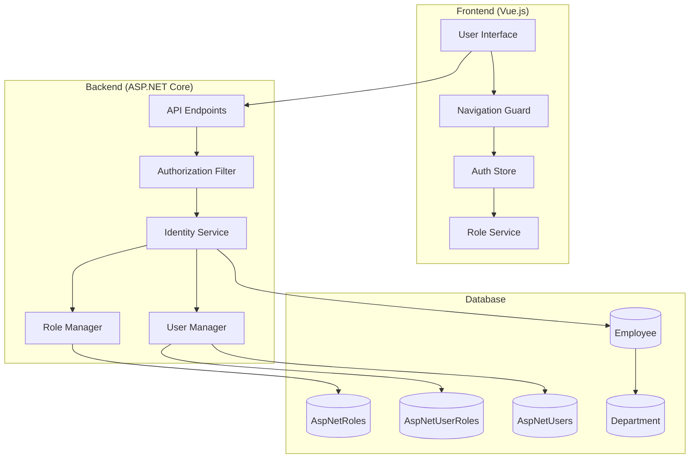
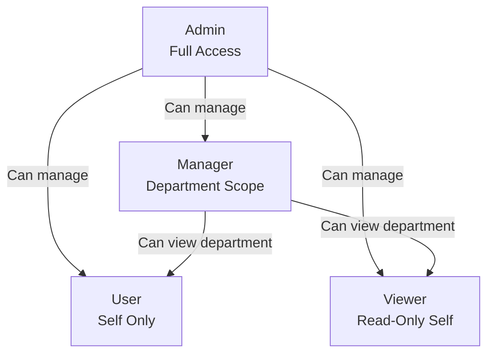

# Design Document

## Overview

ระบบจัดการ Role และ Permission นี้ออกแบบมาเพื่อควบคุมการเข้าถึงและการมองเห็นข้อมูลในระบบตาม Role ของผู้ใช้งาน โดยมี 4 Roles หลัก: **Admin**, **Manager**, **User**, และ **Viewer** แต่ละ Role จะมีสิทธิ์ในการเข้าถึง Navigation Items, การกรองข้อมูล และการดำเนินการ (Create/Edit/Delete) ที่แตกต่างกัน

ระบบนี้จะทำงานทั้งฝั่ง Backend (ASP.NET Core) และ Frontend (Vue.js) โดยใช้ ASP.NET Identity สำหรับการจัดการ Roles และ Authorization Policies สำหรับการควบคุมสิทธิ์

## Architecture

### High-Level Architecture



### Role Hierarchy



## Components and Interfaces

### Backend Components

#### 1. Role Constants (Domain Layer)

**File**: `src/Domain/Constants/Roles.cs`

```csharp
namespace ProjectManagement.Domain.Constants;

public abstract class Roles
{
    public const string Administrator = nameof(Administrator);
    public const string Admin = nameof(Admin);
    public const string Manager = nameof(Manager);
    public const string User = nameof(User);
    public const string Viewer = nameof(Viewer);
}
```

#### 2. Authorization Policies (Domain Layer)

**File**: `src/Domain/Constants/Policies.cs`

```csharp
namespace ProjectManagement.Domain.Constants;

public abstract class Policies
{
    public const string CanPurge = nameof(CanPurge);
    public const string CanManageUsers = nameof(CanManageUsers);
    public const string CanManageMasterData = nameof(CanManageMasterData);
    public const string CanViewMasterData = nameof(CanViewMasterData);
    public const string CanViewDepartmentData = nameof(CanViewDepartmentData);
    public const string CanViewOwnData = nameof(CanViewOwnData);
    public const string CanModifyData = nameof(CanModifyData);
    public const string ReadOnly = nameof(ReadOnly);
}
```

#### 3. Enhanced Identity Service Interface

**File**: `src/Application/Common/Interfaces/IIdentityService.cs`

เพิ่ม methods ใหม่:

- `Task<IEnumerable<ApplicationUser>> GetAllUsersAsync()`
- `Task<ApplicationUser?> GetUserByIdAsync(string userId)`
- `Task<Result> AssignRoleAsync(string userId, string roleName)`
- `Task<Result> RemoveRoleAsync(string userId, string roleName)`
- `Task<IEnumerable<string>> GetUserRolesAsync(string userId)`
- `Task<IEnumerable<ApplicationUser>> GetUsersByDepartmentAsync(Guid departmentId)`

#### 4. User Query Service (Application Layer)

**File**: `src/Application/Users/Queries/GetAllUsers/GetAllUsersQuery.cs`

```csharp
public class GetAllUsersQuery : IRequest<Result<List<UserDto>>>
{
    public string? SearchTerm { get; set; }
    public string? RoleFilter { get; set; }
    public bool? IsActiveFilter { get; set; }
}

public class UserDto
{
    public string UserId { get; set; }
    public string Username { get; set; }
    public string Email { get; set; }
    public string? FirstName { get; set; }
    public string? LastName { get; set; }
    public string? ImageProfile { get; set; }
    public string? Department { get; set; }
    public Guid? DepartmentId { get; set; }
    public List<string> Roles { get; set; }
    public bool IsActive { get; set; }
    public DateTime? LastLoginDate { get; set; }
}
```

#### 5. Role Assignment Command (Application Layer)

**File**: `src/Application/Users/Commands/AssignRole/AssignRoleCommand.cs`

```csharp
public class AssignRoleCommand : IRequest<Result>
{
    public string UserId { get; set; }
    public string RoleName { get; set; }
}
```

#### 6. Data Filtering Service (Application Layer)

**File**: `src/Application/Common/Interfaces/IDataFilterService.cs`

```csharp
public interface IDataFilterService
{
    Task<IQueryable<T>> ApplyRoleBasedFilter<T>(
        IQueryable<T> query,
        string userId,
        string[] roles
    ) where T : class;

    Task<bool> CanAccessResource(
        string userId,
        string[] roles,
        string resourceOwnerId,
        Guid? resourceDepartmentId = null
    );
}
```

#### 7. Authorization Handlers (Infrastructure Layer)

**File**: `src/Infrastructure/Identity/Authorization/DepartmentAuthorizationHandler.cs`

```csharp
public class DepartmentAuthorizationHandler :
    AuthorizationHandler<DepartmentRequirement, Employee>
{
    protected override Task HandleRequirementAsync(
        AuthorizationHandlerContext context,
        DepartmentRequirement requirement,
        Employee resource)
    {
        // Check if user is in same department
        // Succeed if Admin or Manager in same department
    }
}
```

### Frontend Components

#### 1. Role Service (Utils)

**File**: `src/client_web/src/utils/RoleService.ts`

```typescript
export class RoleService {
  static readonly ADMIN = "Admin";
  static readonly MANAGER = "Manager";
  static readonly USER = "User";
  static readonly VIEWER = "Viewer";

  isAdmin(roles: string[]): boolean;
  isManager(roles: string[]): boolean;
  isUser(roles: string[]): boolean;
  isViewer(roles: string[]): boolean;

  canAccessMasterData(roles: string[]): boolean;
  canModifyData(roles: string[]): boolean;
  canViewDepartmentData(roles: string[]): boolean;
}
```

#### 2. Navigation Items with Role-Based Filtering

**File**: `src/client_web/src/layouts/components/NavItems.vue`

อัพเดทให้ใช้ roles ใหม่:

- Admin, Manager: เห็น Master Data, Activity Plans, Projects, Employees, Check-in/Check-out, Reports
- User: เห็น Activity Plans, Projects, Check-in/Check-out, Reports
- Viewer: เห็น Activity Plans, Projects, Check-in/Check-out, Reports (read-only)

#### 3. Route Guards

**File**: `src/client_web/src/router/guards.ts`

```typescript
export function roleGuard(
  to: RouteLocationNormalized,
  from: RouteLocationNormalized
) {
  const authStore = useAuthStore();
  const requiredRoles = to.meta.roles as string[];

  if (requiredRoles && !authStore.hasRole(...requiredRoles)) {
    return { name: "not-authorized" };
  }
}
```

#### 4. User Management Page

**File**: `src/client_web/src/views/MasterData/Users/UserListView.vue`

- แสดงตาราง Users ทั้งหมด
- มีฟังก์ชัน Search และ Filter
- มีปุ่ม "กำหนด Role" สำหรับแต่ละ User
- Dialog สำหรับเลือก Role

#### 5. Account Settings Enhancement

**File**: `src/client_web/src/views/pages/account-settings/AccountSettingsAccount.vue`

- ดึงข้อมูล FirstName, LastName, Email จาก Employee/ApplicationUser
- เพิ่มฟังก์ชันอัพโหลดรูป Profile ไป MinIO
- แสดง Preview รูปภาพ
- Validation ไฟล์ (ประเภท, ขนาด)

## Data Models

### Database Schema

#### AspNetRoles Table

```sql
CREATE TABLE AspNetRoles (
    Id NVARCHAR(450) PRIMARY KEY,
    Name NVARCHAR(256),
    NormalizedName NVARCHAR(256),
    ConcurrencyStamp NVARCHAR(MAX)
)
```

**Seed Data**:

- Admin
- Manager
- User
- Viewer

#### AspNetUserRoles Table

```sql
CREATE TABLE AspNetUserRoles (
    UserId NVARCHAR(450) FOREIGN KEY REFERENCES AspNetUsers(Id),
    RoleId NVARCHAR(450) FOREIGN KEY REFERENCES AspNetRoles(Id),
    PRIMARY KEY (UserId, RoleId)
)
```

#### Employee Table Enhancement

เพิ่มฟิลด์:

- `Roles` (string) - เก็บ Role name สำหรับ quick access
- `ImageProfile` (string) - URL ของรูป profile ใน MinIO

### DTOs

#### UserDto

```csharp
public class UserDto
{
    public string UserId { get; set; }
    public string Username { get; set; }
    public string Email { get; set; }
    public string? FirstName { get; set; }
    public string? LastName { get; set; }
    public string? ImageProfile { get; set; }
    public string? Department { get; set; }
    public Guid? DepartmentId { get; set; }
    public List<string> Roles { get; set; }
    public bool IsActive { get; set; }
    public DateTime? LastLoginDate { get; set; }
}
```

#### AssignRoleDto

```csharp
public class AssignRoleDto
{
    public string UserId { get; set; }
    public string RoleName { get; set; }
}
```

#### ProfileImageUploadDto

```csharp
public class ProfileImageUploadDto
{
    public IFormFile ImageFile { get; set; }
    public string UserId { get; set; }
}
```

## Error Handling

### Backend Error Responses

#### 401 Unauthorized

```json
{
  "statusCode": 401,
  "message": "คุณไม่มีสิทธิ์เข้าถึงระบบ กรุณาเข้าสู่ระบบ"
}
```

#### 403 Forbidden

```json
{
  "statusCode": 403,
  "message": "คุณไม่มีสิทธิ์เข้าถึงข้อมูลนี้"
}
```

#### 400 Bad Request (Role Assignment)

```json
{
  "statusCode": 400,
  "message": "ไม่สามารถกำหนด Role ได้",
  "errors": ["Role ที่เลือกไม่ถูกต้อง"]
}
```

### Frontend Error Handling

- แสดง SweetAlert2 สำหรับ error messages
- Redirect ไป `/not-authorized` สำหรับ 403 errors
- Redirect ไป `/login` สำหรับ 401 errors
- แสดง validation errors ใน form

## Testing Strategy

### Unit Tests

#### Backend

1. **IdentityService Tests**

   - Test AssignRoleAsync with valid/invalid roles
   - Test GetUsersByDepartmentAsync filtering
   - Test RemoveRoleAsync

2. **DataFilterService Tests**

   - Test ApplyRoleBasedFilter for each role
   - Test CanAccessResource with different scenarios

3. **Authorization Handler Tests**
   - Test DepartmentAuthorizationHandler
   - Test role-based policy evaluation

#### Frontend

1. **RoleService Tests**

   - Test role checking methods
   - Test permission methods

2. **Auth Store Tests**
   - Test role assignment
   - Test menu generation based on roles

### Integration Tests

1. **User Management API Tests**

   - Test GET /api/users (Admin only)
   - Test POST /api/users/assign-role (Admin only)
   - Test GET /api/users/{id} with different roles

2. **Data Filtering Tests**

   - Test Activity Plans filtering by role
   - Test Employee list filtering by department
   - Test unauthorized access attempts

3. **Navigation Tests**
   - Test Master Data menu visibility by role
   - Test route guards with different roles

### Functional Tests

1. **Role Assignment Flow**

   - Admin logs in
   - Navigates to User Management
   - Assigns role to user
   - Verify role is updated in database and UI

2. **Data Filtering Flow**

   - Manager logs in
   - Views Activity Plans
   - Verify only department data is shown

3. **Profile Image Upload Flow**
   - User logs in
   - Uploads profile image
   - Verify image is stored in MinIO
   - Verify image URL is saved in database

## Security Considerations

### Backend Security

1. **Authorization Policies**

   - ใช้ `[Authorize(Policy = "PolicyName")]` attribute
   - ตรวจสอบ Role ใน Authorization Handler
   - ใช้ Claims-based authorization

2. **Data Filtering**

   - Apply filters ที่ database level (IQueryable)
   - ไม่ส่งข้อมูลที่ไม่มีสิทธิ์เข้าถึงไปยัง client
   - Validate resource ownership ก่อน modify

3. **File Upload Security**
   - Validate file type (JPEG, PNG, JPG, GIF)
   - Validate file size (max 5MB)
   - Sanitize filename
   - Store in MinIO with unique path

### Frontend Security

1. **Route Guards**

   - ตรวจสอบ authentication ก่อนเข้า route
   - ตรวจสอบ role requirements
   - Redirect ถ้าไม่มีสิทธิ์

2. **UI Element Visibility**

   - ซ่อนปุ่ม/เมนูที่ไม่มีสิทธิ์
   - Disable actions สำหรับ Viewer role
   - แสดง read-only mode เมื่อเหมาะสม

3. **Token Management**
   - เก็บ JWT token ใน localStorage
   - ตรวจสอบ token expiration
   - Auto logout เมื่อ token หมดอายุ

## Performance Considerations

1. **Database Queries**

   - ใช้ Index บน DepartmentId, UserId
   - ใช้ Eager Loading สำหรับ related entities
   - Cache role data ใน memory

2. **Frontend**

   - Cache user roles ใน Auth Store
   - Lazy load navigation items
   - Optimize image loading (thumbnails)

3. **File Storage**
   - ใช้ MinIO สำหรับ scalable storage
   - Generate thumbnails สำหรับ profile images
   - Use CDN ถ้าเป็นไปได้

## Migration Strategy

### Database Migration

1. **Add Roles to AspNetRoles**

```csharp
migrationBuilder.InsertData(
    table: "AspNetRoles",
    columns: new[] { "Id", "Name", "NormalizedName" },
    values: new object[,]
    {
        { Guid.NewGuid().ToString(), "Admin", "ADMIN" },
        { Guid.NewGuid().ToString(), "Manager", "MANAGER" },
        { Guid.NewGuid().ToString(), "User", "USER" },
        { Guid.NewGuid().ToString(), "Viewer", "VIEWER" }
    });
```

2. **Update Employee Table**

```csharp
migrationBuilder.AddColumn<string>(
    name: "Roles",
    table: "Employees",
    nullable: true);

migrationBuilder.AddColumn<string>(
    name: "ImageProfile",
    table: "Employees",
    nullable: true);
```

### Data Migration

1. **Create Default Admin User**

```csharp
// Seed default admin user
var adminUser = new ApplicationUser
{
    UserName = "admin",
    Email = "admin@projectmanagement.com",
    EmailConfirmed = true,
    RequirePasswordChange = false,
    LastPasswordChangeDate = DateTime.UtcNow
};

await userManager.CreateAsync(adminUser, "Admin@123");
await userManager.AddToRoleAsync(adminUser, "Admin");

// Create corresponding Employee record
var adminEmployee = new Employee
{
    UserId = adminUser.Id,
    FirstName = "Admin",
    LastName = "System",
    Email = adminUser.Email,
    isActive = true,
    Roles = "Admin"
};
```

**Default Admin Credentials**:

- Username: `admin`
- Email: `admin@projectmanagement.com`
- Password: `Admin@123`

2. **Assign Default Roles**

   - Existing users → User role
   - Administrators → Admin role
   - Department heads → Manager role

3. **Sync Employee.Roles with AspNetUserRoles**
   - Create background job to sync
   - Run once after deployment

## Deployment Checklist

- [ ] Run database migrations
- [ ] Seed roles in AspNetRoles
- [ ] Assign default roles to existing users
- [ ] Update authorization policies in Startup
- [ ] Deploy backend API
- [ ] Update frontend environment variables
- [ ] Deploy frontend application
- [ ] Test role-based access
- [ ] Test data filtering
- [ ] Test profile image upload
- [ ] Monitor logs for authorization errors
