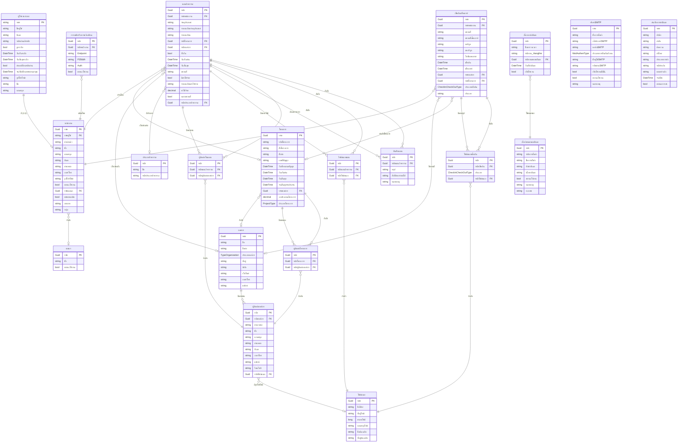

# ER Diagram - ระบบบริหารจัดการโครงการ (Project Management System)

## ภาพรวมระบบ

ระบบนี้เป็นระบบบริหารจัดการโครงการที่ครอบคลุม:

- การจัดการผู้ใช้งานและพนักงาน
- การจัดการองค์กรและโครงการ
- การวางแผนกิจกรรม (Activity Planning)
- การเช็คอิน-เช็คเอาท์
- การจัดการเอกสารแนบ
- ระบบอีเมล (Email System & Scheduling)
- การแจ้งเตือนแบบ Push Notifications

---

## Entity Relationship Diagram

---

## คำอธิบายความสัมพันธ์หลัก

### 1. การจัดการผู้ใช้และพนักงาน

- **ผู้ใช้งานระบบ ↔ พนักงาน**: ความสัมพันธ์แบบ 1:1 (ไม่บังคับ)
  - ผู้ใช้งานอาจมีหรือไม่มีข้อมูลพนักงานก็ได้
  - พนักงานจะต้องมีบัญชีผู้ใช้งานเสมอ
- **พนักงาน → แผนก**: หลายต่อหนึ่ง (ไม่บังคับ)
  - พนักงานหลายคนสังกัดแผนกเดียว

### 2. องค์กรและผู้ติดต่อ

- **องค์กร → ผู้ติดต่อองค์กร**: หนึ่งต่อหลาย
  - องค์กรหนึ่งมีผู้ติดต่อได้หลายคน
- **ผู้ติดต่อองค์กร → ไฟล์แนบ**: หลายต่อหนึ่ง (ไม่บังคับ)
  - ผู้ติดต่ออาจมีรูปโปรไฟล์

### 3. การจัดการโครงการ

- **โครงการ → องค์กร**: หลายต่อหนึ่ง (ไม่บังคับ)
  - โครงการอาจสังกัดองค์กรหนึ่ง
- **โครงการ ↔ ผู้ติดต่อองค์กร**: หลายต่อหลาย (ผ่านผู้ติดต่อโครงการ)
  - โครงการมีผู้ติดต่อได้หลายคน

### 4. การวางแผนกิจกรรม

- **แผนกิจกรรม → พนักงาน**: หลายต่อหนึ่ง
  - กิจกรรมถูกสร้างโดยพนักงานคนหนึ่ง
- **แผนกิจกรรม → โครงการ/องค์กร**: หลายต่อหนึ่ง (ไม่บังคับ)
  - กิจกรรมอาจเกี่ยวข้องกับโครงการหรือองค์กร
- **แผนกิจกรรม → ประเภทกิจกรรม**: หลายต่อหนึ่ง (ไม่บังคับ)
  - กิจกรรมมีประเภทกิจกรรม
- **แผนกิจกรรม ↔ ผู้ติดต่อองค์กร**: หลายต่อหลาย (ผ่านผู้ติดต่อในแผน)
  - กิจกรรมมีผู้เข้าร่วมได้หลายคน
- **แผนกิจกรรม ↔ ไฟล์แนบ**: หลายต่อหลาย (ผ่านไฟล์แนบแผน)
  - กิจกรรมมีเอกสารแนบได้หลายไฟล์
- **แผนกิจกรรม → บันทึกแผน**: หนึ่งต่อหลาย
  - กิจกรรมมีบันทึกได้หลายรายการ

### 5. การเช็คอิน-เช็คเอาท์

- **เช็คอินเช็คเอาท์ → พนักงาน**: หลายต่อหนึ่ง
  - การเช็คอินถูกทำโดยพนักงานคนหนึ่ง
- **เช็คอินเช็คเอาท์ → โครงการ/องค์กร**: หลายต่อหนึ่ง (ไม่บังคับ)
  - การเช็คอินอาจเกี่ยวข้องกับโครงการหรือองค์กร
- **เช็คอินเช็คเอาท์ ↔ ไฟล์แนบ**: หลายต่อหลาย (ผ่านไฟล์แนบเช็คอิน)
  - การเช็คอินมีรูปภาพแนบได้หลายรูป

### 6. ระบบอีเมล

- **ตั้งเวลาส่งอีเมล → ตั้งค่าเทมเพลตอีเมล**: หลายต่อหนึ่ง
  - ตารางเวลาส่งอีเมลอ้างอิงเทมเพลตอีเมล
- **ตั้งค่าSMTP**: ตั้งค่า SMTP สำหรับส่งอีเมล (ไม่มีความสัมพันธ์โดยตรงใน Entity)
- **บันทึกการส่งอีเมล**: บันทึกการส่งอีเมลทั้งหมด (ไม่มีความสัมพันธ์โดยตรงใน Entity)

### 7. การแจ้งเตือนแบบ Push

- **การสมัครรับการแจ้งเตือน → พนักงาน**: หลายต่อหนึ่ง
  - พนักงานสามารถสมัครรับการแจ้งเตือนจากหลายอุปกรณ์

---

## ชนิดข้อมูลแบบกำหนด (Enums)

### TypeOrganization (ประเภทองค์กร)

- ประเภทขององค์กร (เช่น หน่วยงานราชการ, เอกชน, ฯลฯ)

### ProjectType (ประเภทโครงการ)

- ประเภทของโครงการ

### CheckInCheckOutType (ประเภทเช็คอิน)

- ประเภทของการเช็คอิน/เช็คเอาท์

### MailAuthenType (ประเภทการยืนยันตัวตนอีเมล)

- ประเภทการยืนยันตัวตนของ SMTP (เช่น None, Basic, OAuth2)

### PriorityLevel (ระดับความสำคัญ)

- ระดับความสำคัญของงาน

---

## ตารางฐาน (Base Entities)

ทุกตาราง (ยกเว้น ApplicationUser ที่สืบทอดจาก IdentityUser) สืบทอดจาก `BaseAuditableEntity` ซึ่งมี:

- `Id` (Guid) - คีย์หลัก
- `Created` (DateTime) - วันที่สร้าง
- `CreatedBy` (string) - ผู้สร้าง
- `LastModified` (DateTime?) - วันที่แก้ไขล่าสุด
- `LastModifiedBy` (string?) - ผู้แก้ไขล่าสุด
- `IsDeleted` (bool) - สถานะการลบแบบซอฟต์

---

## การใช้งานหลัก

1. **การจัดการผู้ใช้**: ผู้ใช้งานระบบ + พนักงาน + แผนก
2. **การจัดการองค์กร**: องค์กร + ผู้ติดต่อองค์กร
3. **การจัดการโครงการ**: โครงการ + ผู้ติดต่อโครงการ
4. **การวางแผนกิจกรรม**: แผนกิจกรรม + ผู้ติดต่อในแผน + ไฟล์แนบแผน + บันทึกแผน + ประเภทกิจกรรม
5. **การติดตามการทำงาน**: เช็คอินเช็คเอาท์ + ไฟล์แนบเช็คอิน
6. **การจัดการไฟล์**: ไฟล์แนบ (ใช้ร่วมกันทั้งระบบ)
7. **ระบบอีเมล**: ตั้งค่าSMTP + ตั้งค่าเทมเพลตอีเมล + ตั้งเวลาส่งอีเมล + บันทึกการส่งอีเมล
8. **การแจ้งเตือน**: การสมัครรับการแจ้งเตือน (Push Notifications)

---

## หมายเหตุสำคัญ

- ระบบใช้ ASP.NET Core Identity สำหรับการจัดการผู้ใช้งาน (ผู้ใช้งานระบบสืบทอดจาก IdentityUser)
- ใช้ Soft Delete Pattern (IsDeleted) สำหรับการลบข้อมูล
- ใช้ Audit Pattern (Created, CreatedBy, LastModified, LastModifiedBy) สำหรับติดตามการเปลี่ยนแปลง
- ไฟล์แนบใช้ร่วมกันในหลายส่วนของระบบ
- ระบบรองรับการทำงานแบบ Multi-tenant ผ่านองค์กร

## การแมปชื่อ Entity (ภาษาไทย ↔ ภาษาอังกฤษ)

| ภาษาไทย | ภาษาอังกฤษ (ในโค้ด) |
|---------|---------------------|
| ผู้ใช้งานระบบ | ApplicationUser |
| พนักงาน | Employee |
| แผนก | Department |
| องค์กร | Organization |
| ผู้ติดต่อองค์กร | OrganizationContact |
| โครงการ | Project |
| ผู้ติดต่อโครงการ | ProjectContact |
| แผนกิจกรรม | ActivityPlan |
| ผู้ติดต่อในแผน | ActivityPlanContact |
| ไฟล์แนบแผน | ActivityPlanAttachment |
| ประเภทกิจกรรม | EventType |
| บันทึกแผน | PlanNote |
| เช็คอินเช็คเอาท์ | CheckInCheckOut |
| ไฟล์แนบเช็คอิน | CheckInCheckOutAttachment |
| ไฟล์แนบ | Attachment |
| ตั้งค่าSMTP | SMTPSetting |
| ตั้งค่าเทมเพลตอีเมล | EmailMessageSetting |
| ตั้งเวลาส่งอีเมล | EmailScheduleSetting |
| บันทึกการส่งอีเมล | EmailLog |
| การสมัครรับการแจ้งเตือน | PushSubscription |

---

# ER Diagram (English Version)

## System Overview

This is a comprehensive project management system that includes:

- User and Employee Management
- Organization and Project Management
- Activity Planning
- Check-in/Check-out System
- Attachment Management
- Email System & Scheduling
- Push Notifications

---

## Entity Relationship Diagram (English)

```mermaid
erDiagram
    %% User and Employee Management
    ApplicationUser ||--o| Employee : "has (1:1)"
    Employee }o--o| Department : "belongs to"

    %% Organization Management
    Organization ||--o{ OrganizationContact : "has many"
    OrganizationContact }o--o| Attachment : "has profile picture"

    %% Project Management
    Project }o--o| Organization : "belongs to"
    Project ||--o{ ProjectContact : "has many"
    ProjectContact }o--|| Project : "belongs to"
    ProjectContact }o--|| OrganizationContact : "references"

    %% Activity Planning
    ActivityPlan }o--|| Employee : "created by"
    ActivityPlan }o--o| Project : "related to"
    ActivityPlan }o--o| Organization : "related to"
    ActivityPlan }o--o| EventType : "has type"
    ActivityPlan ||--o{ ActivityPlanContact : "has many"
    ActivityPlan ||--o{ ActivityPlanAttachment : "has many files"
    ActivityPlan ||--o{ PlanNote : "has many notes"

    ActivityPlanContact }o--|| ActivityPlan : "belongs to"
    ActivityPlanContact }o--|| OrganizationContact : "references"
    ActivityPlanAttachment }o--|| ActivityPlan : "belongs to"
    ActivityPlanAttachment }o--|| Attachment : "references"

    %% Check-in/Check-out
    CheckInCheckOut }o--|| Employee : "performed by"
    CheckInCheckOut }o--o| Organization : "at location"
    CheckInCheckOut }o--o| Project : "for project"
    CheckInCheckOut ||--o{ CheckInCheckOutAttachment : "has many photos"
    CheckInCheckOutAttachment }o--|| CheckInCheckOut : "belongs to"
    CheckInCheckOutAttachment }o--|| Attachment : "references"

    %% Plan Notes
    PlanNote }o--|| ActivityPlan : "belongs to"

    %% Email System
    EmailScheduleSetting }o--|| EmailMessageSetting : "uses template"

    %% Push Notifications
    PushSubscription }o--|| Employee : "subscribed by"

    %% Entity Definitions
    ApplicationUser {
        string Id PK
        string UserName
        string Email
        string PasswordHash
        bool IsRevoked
        DateTime RevokeStart
        DateTime RevokeEnd
        bool RequirePasswordChange
        DateTime LastPasswordChangeDate
        string ImageProfile
        string FirstName
        string LastName
    }

    Employee {
        Guid Id PK
        string UserId FK
        string TitleName
        string FirstName
        string LastName
        string Email
        string Position
        string Phone
        string ImageProfile
        bool isActive
        Guid DepartmentId FK
        bool Subscription
        string Roles
        string Group
    }

    Department {
        Guid Id PK
        string Name
        bool IsActive
    }

    Organization {
        Guid Id PK
        string Name
        string ShortName
        TypeOrganization TypeOrganization
        string Address
        string Coordinates
        string WebSite
        string Phone
        string Fax
    }

    OrganizationContact {
        Guid Id PK
        Guid OrganizationId FK
        string TitleName
        string FirstName
        string LastName
        string Position
        string Email
        string Phone
        string Fax
        string LineId
        Guid AttachmentId FK
    }

    Project {
        Guid Id PK
        string ProjectCode
        string ProjectName
        string ShortName
        string ContractNumber
        DateTime ContractSignedDate
        DateTime StartDate
        DateTime EndDate
        DateTime WarrantyEndDate
        Guid OrganizationId FK
        decimal ProjectCost
        ProjectType ProjectType
    }

    ProjectContact {
        Guid Id PK
        Guid ProjectId FK
        Guid OrganizationContactId FK
    }

    ActivityPlan {
        Guid Id PK
        Guid EmployeeId FK
        string Objective
        string ObjectiveDetail
        string detail
        Guid ProjectId FK
        Guid OrganizationId FK
        bool AllDay
        DateTime StartDate
        DateTime EndDate
        string Location
        bool HaveCost
        string CostDetail
        decimal Cost
        bool OutSide
        Guid EventTypeId FK
    }

    ActivityPlanContact {
        Guid Id PK
        Guid ActivityPlanId FK
        Guid OrganizationContactId FK
    }

    ActivityPlanAttachment {
        Guid Id PK
        Guid ActivityPlanId FK
        Guid AttachmentId FK
    }

    EventType {
        Guid Id PK
        string Name
        string EventTypeCode
    }

    PlanNote {
        Guid Id PK
        Guid ActivityPlanId FK
        string Summary
        string ToDoNext
        string Remarks
    }

    CheckInCheckOut {
        Guid Id PK
        Guid EmployeeId FK
        string Location
        string LocationCheckOut
        string Lat
        string Long
        string IPAddress
        DateTime CheckIn
        DateTime CheckOut
        Guid OrganizationId FK
        Guid ProjectId FK
        CheckInCheckOutType CheckInCheckOutTypes
        string Types
    }

    CheckInCheckOutAttachment {
        Guid Id PK
        Guid CheckInCheckOutId FK
        CheckInCheckOutType Type
        Guid AttachmentId FK
    }

    Attachment {
        Guid Id PK
        string NameFile
        string PathFile
        long FileSize
        string FileExtension
        string BucketOriginalName
        string BucketOriginalPath
    }

    SMTPSetting {
        Guid Id PK
        string ConfigName
        string SMTPServer
        string SMTPPort
        MailAuthenType SMTPAuthentication
        string SMTPUserName
        string SMTPPassword
        bool SMTPEnableSSL
        bool IsActive
        string Remark
    }

    EmailMessageSetting {
        Guid Id PK
        string SettingCode
        string SettingName
        string MailSubject
        string MailBody
        bool IsActive
        string Remark
        string Sendtime
    }

    EmailScheduleSetting {
        Guid Id PK
        string ScheduleName
        string HangfireJobId
        Guid EmailMessageSettingId FK
        DateTime SendMailDate
        bool IsEnabled
    }

    EmailLog {
        Guid Id PK
        string Subject
        string SentTo
        string Massage
        string SendBy
        string SendType
        string RefEntityId
        string RefEntityClass
        DateTime SendDate
        bool SendStatus
    }

    PushSubscription {
        Guid Id PK
        Guid EmployeeId FK
        string Endpoint
        string P256dh
        string Auth
        bool IsActive
    }
```

---

## Key Relationships

### 1. User and Employee Management

- **ApplicationUser ↔ Employee**: 1:1 relationship (optional)
  - A user may or may not have employee information
  - An employee must always have a user account
- **Employee → Department**: Many-to-One (optional)
  - Multiple employees belong to one department

### 2. Organization and Contacts

- **Organization → OrganizationContact**: One-to-Many
  - One organization has many contacts
- **OrganizationContact → Attachment**: Many-to-One (optional)
  - A contact may have a profile picture

### 3. Project Management

- **Project → Organization**: Many-to-One (optional)
  - A project may belong to one organization
- **Project ↔ OrganizationContact**: Many-to-Many (through ProjectContact)
  - A project has many contacts

### 4. Activity Planning

- **ActivityPlan → Employee**: Many-to-One
  - An activity is created by one employee
- **ActivityPlan → Project/Organization**: Many-to-One (optional)
  - An activity may be related to a project or organization
- **ActivityPlan → EventType**: Many-to-One (optional)
  - An activity has an event type
- **ActivityPlan ↔ OrganizationContact**: Many-to-Many (through ActivityPlanContact)
  - An activity has many participants
- **ActivityPlan ↔ Attachment**: Many-to-Many (through ActivityPlanAttachment)
  - An activity has many attachments
- **ActivityPlan → PlanNote**: One-to-Many
  - An activity has many notes

### 5. Check-in/Check-out

- **CheckInCheckOut → Employee**: Many-to-One
  - A check-in is performed by one employee
- **CheckInCheckOut → Project/Organization**: Many-to-One (optional)
  - A check-in may be related to a project or organization
- **CheckInCheckOut ↔ Attachment**: Many-to-Many (through CheckInCheckOutAttachment)
  - A check-in has many photos

### 6. Email System

- **EmailScheduleSetting → EmailMessageSetting**: Many-to-One
  - Email schedule references an email template
- **SMTPSetting**: SMTP configuration for sending emails (no direct entity relationship)
- **EmailLog**: Email sending log (no direct entity relationship)

### 7. Push Notifications

- **PushSubscription → Employee**: Many-to-One
  - An employee can subscribe from multiple devices

---

## Enumerations

### TypeOrganization
- Organization types (e.g., Government, Private, etc.)

### ProjectType
- Project types

### CheckInCheckOutType
- Check-in/Check-out types

### MailAuthenType
- SMTP authentication types (e.g., None, Basic, OAuth2)

### PriorityLevel
- Task priority levels

---

## Base Entities

All entities (except ApplicationUser which inherits from IdentityUser) inherit from `BaseAuditableEntity` which includes:

- `Id` (Guid) - Primary key
- `Created` (DateTime) - Creation date
- `CreatedBy` (string) - Creator
- `LastModified` (DateTime?) - Last modification date
- `LastModifiedBy` (string?) - Last modifier
- `IsDeleted` (bool) - Soft delete status

---

## Main Features

1. **User Management**: ApplicationUser + Employee + Department
2. **Organization Management**: Organization + OrganizationContact
3. **Project Management**: Project + ProjectContact
4. **Activity Planning**: ActivityPlan + ActivityPlanContact + ActivityPlanAttachment + PlanNote + EventType
5. **Work Tracking**: CheckInCheckOut + CheckInCheckOutAttachment
6. **File Management**: Attachment (shared across the system)
7. **Email System**: SMTPSetting + EmailMessageSetting + EmailScheduleSetting + EmailLog
8. **Notifications**: PushSubscription (Push Notifications)

---

## Important Notes

- System uses ASP.NET Core Identity for user management (ApplicationUser inherits from IdentityUser)
- Uses Soft Delete Pattern (IsDeleted) for data deletion
- Uses Audit Pattern (Created, CreatedBy, LastModified, LastModifiedBy) for change tracking
- Attachments are shared across multiple parts of the system
- System supports Multi-tenant operations through Organization
