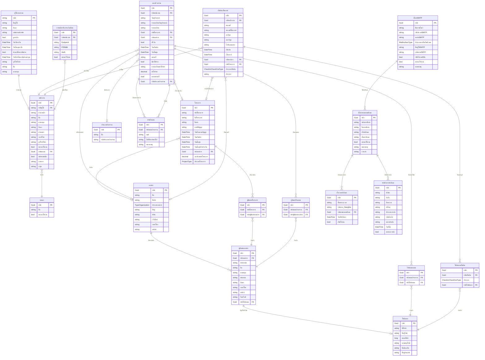

# ER Diagram - ระบบบริหารจัดการโครงการ (Project Management System)

## ภาพรวมระบบ

ระบบนี้เป็นระบบบริหารจัดการโครงการที่ครอบคลุม:

- การจัดการผู้ใช้งานและพนักงาน
- การจัดการองค์กรและโครงการ
- การวางแผนกิจกรรม (Activity Planning)
- การเช็คอิน-เช็คเอาท์
- การจัดการเอกสารแนบ
- ระบบอีเมล (Email System & Scheduling)
- การแจ้งเตือนแบบ Push Notifications

---

## Entity Relationship Diagram

---

## คำอธิบายความสัมพันธ์หลัก

### 1. การจัดการผู้ใช้และพนักงาน

- **ผู้ใช้งานระบบ ↔ พนักงาน**: ความสัมพันธ์แบบ 1:1 (ไม่บังคับ)
  - ผู้ใช้งานอาจมีหรือไม่มีข้อมูลพนักงานก็ได้
  - พนักงานจะต้องมีบัญชีผู้ใช้งานเสมอ
- **พนักงาน → แผนก**: หลายต่อหนึ่ง
  - พนักงานหลายคนสังกัดแผนกเดียว

### 2. องค์กรและผู้ติดต่อ

- **องค์กร → ผู้ติดต่อองค์กร**: หนึ่งต่อหลาย
  - องค์กรหนึ่งมีผู้ติดต่อได้หลายคน
- **ผู้ติดต่อองค์กร → ไฟล์แนบ**: หลายต่อหนึ่ง (ไม่บังคับ)
  - ผู้ติดต่ออาจมีรูปโปรไฟล์

### 3. การจัดการโครงการ

- **โครงการ → องค์กร**: หลายต่อหนึ่ง (ไม่บังคับ)
  - โครงการอาจสังกัดองค์กรหนึ่ง
- **โครงการ ↔ ผู้ติดต่อองค์กร**: หลายต่อหลาย (ผ่านผู้ติดต่อโครงการ)
  - โครงการมีผู้ติดต่อได้หลายคน

### 4. การวางแผนกิจกรรม

- **แผนกิจกรรม → พนักงาน**: หลายต่อหนึ่ง
  - กิจกรรมถูกสร้างโดยพนักงานคนหนึ่ง
- **แผนกิจกรรม → โครงการ/องค์กร**: หลายต่อหนึ่ง (ไม่บังคับ)
  - กิจกรรมอาจเกี่ยวข้องกับโครงการหรือองค์กร
- **แผนกิจกรรม ↔ ผู้ติดต่อองค์กร**: หลายต่อหลาย (ผ่านผู้ติดต่อในแผน)
  - กิจกรรมมีผู้เข้าร่วมได้หลายคน
- **แผนกิจกรรม → ไฟล์แนบ**: หนึ่งต่อหลาย (ผ่านไฟล์แนบแผน)
  - กิจกรรมมีเอกสารแนบได้หลายไฟล์
- **แผนกิจกรรม → บันทึกแผน**: หนึ่งต่อหลาย
  - กิจกรรมมีบันทึกได้หลายรายการ

### 5. การเช็คอิน-เช็คเอาท์

- **เช็คอินเช็คเอาท์ → พนักงาน**: หลายต่อหนึ่ง
  - การเช็คอินถูกทำโดยพนักงานคนหนึ่ง
- **เช็คอินเช็คเอาท์ → โครงการ/องค์กร**: หลายต่อหนึ่ง (ไม่บังคับ)
  - การเช็คอินอาจเกี่ยวข้องกับโครงการหรือองค์กร
- **เช็คอินเช็คเอาท์ → ไฟล์แนบ**: หนึ่งต่อหลาย (ผ่านไฟล์แนบเช็คอิน)
  - การเช็คอินมีรูปภาพแนบได้หลายรูป

### 6. ระบบอีเมล

- **ตั้งค่าSMTP → ตั้งค่าเทมเพลตอีเมล**: หนึ่งต่อหลาย
  - การตั้งค่า SMTP ใช้ส่งอีเมลตามเทมเพลตต่างๆ
- **ตั้งค่าเทมเพลตอีเมล → ตั้งเวลาส่งอีเมล**: หนึ่งต่อหลาย
  - เทมเพลตหนึ่งสามารถกำหนดเวลาส่งได้หลายครั้ง
- **ตั้งค่าเทมเพลตอีเมล → บันทึกการส่งอีเมล**: หนึ่งต่อหลาย
  - เทมเพลตมีบันทึกการส่งอีเมลทุกครั้ง

### 7. การแจ้งเตือนแบบ Push

- **การสมัครรับการแจ้งเตือน → พนักงาน**: หลายต่อหนึ่ง
  - พนักงานสามารถสมัครรับการแจ้งเตือนจากหลายอุปกรณ์

---

## ชนิดข้อมูลแบบกำหนด (Enums)

### ประเภทองค์กร (TypeOrganization)

- ประเภทขององค์กร (เช่น หน่วยงานราชการ, เอกชน, ฯลฯ)

### ประเภทโครงการ (ProjectType)

- ประเภทของโครงการ

### ประเภทเช็คอิน (CheckInCheckOutType)

- ประเภทของการเช็คอิน/เช็คเอาท์

### ประเภทการยืนยันตัวตนอีเมล (MailAuthenType)

- ประเภทการยืนยันตัวตนของ SMTP (เช่น None, Basic, OAuth2)

---

## ตารางฐาน (Base Entities)

ทุกตาราง (ยกเว้นผู้ใช้งานระบบ) สืบทอดจาก `ตารางฐานที่ตรวจสอบได้` ซึ่งมี:

- `รหัส` (Guid) - คีย์หลัก
- `สร้างเมื่อ` (DateTime) - วันที่สร้าง
- `สร้างโดย` (string) - ผู้สร้าง
- `แก้ไขล่าสุด` (DateTime?) - วันที่แก้ไขล่าสุด
- `แก้ไขโดย` (string?) - ผู้แก้ไขล่าสุด
- `ถูกลบ` (bool) - สถานะการลบแบบซอฟต์

---

## การใช้งานหลัก

1. **การจัดการผู้ใช้**: ผู้ใช้งานระบบ + พนักงาน + แผนก
2. **การจัดการองค์กร**: องค์กร + ผู้ติดต่อองค์กร
3. **การจัดการโครงการ**: โครงการ + ผู้ติดต่อโครงการ
4. **การวางแผนกิจกรรม**: แผนกิจกรรม + ผู้ติดต่อในแผน + ไฟล์แนบแผน + บันทึกแผน
5. **การติดตามการทำงาน**: เช็คอินเช็คเอาท์ + ไฟล์แนบเช็คอิน
6. **การจัดการไฟล์**: ไฟล์แนบ (ใช้ร่วมกันทั้งระบบ)
7. **ระบบอีเมล**: ตั้งค่าSMTP + ตั้งค่าเทมเพลตอีเมล + ตั้งเวลาส่งอีเมล + บันทึกการส่งอีเมล
8. **การแจ้งเตือน**: การสมัครรับการแจ้งเตือน (Push Notifications)
